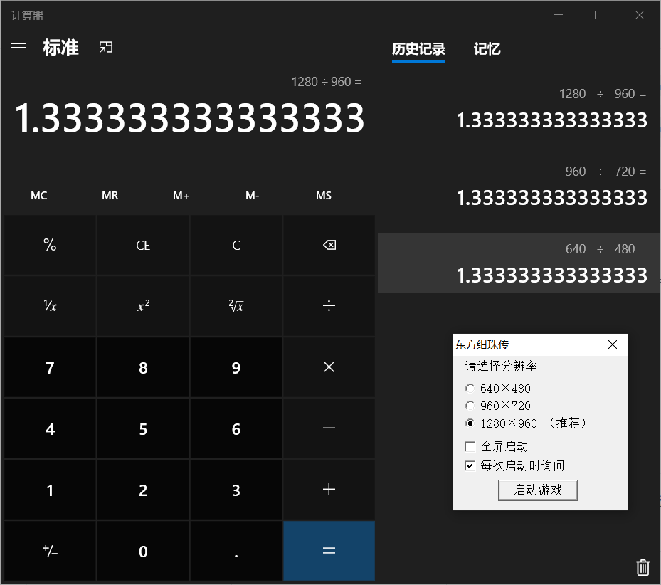

# 东方幻想祭 ~ Memorial Fragments

#### 简介
这是一个基于Unity的东方STG，底层实现了一个简易的STG引擎。

总的来说，我这个仅算是个练习，对于STG最重要的弹设我也是第一次尝试，所以请飞机佬轻喷。但是尝试过比没有接触过要好很多，不是吗？

虽说这STG仅有两面，但是各种基本功能都实现了，对于没有实现的功能比如符卡练习仅需拼UI和调用我封装好的函数即可。

QQ群：787761864   -- 后户研 ~~（生）~~ 究  ~~（草）~~ 所

欢迎各位车万人来玩呀~

#### 安装方法

由于压缩包过大，又没有服务器和好的网盘，只能进群下载了。总之欢迎进群 ~

#### 硬件要求

对CPU、显卡没有太大的要求只要不是什么老古董就行（

仅有的一点要求：电脑屏幕分辨率要大于**1467 x 950**，最好还是1080P吧。

**注意：** 不要试图拉下项目打包在安卓！因为安卓是默认全屏也就是说在安卓上跑会拉伸，由于妖精的出场、路径动画等等都是基于该分辨率的坐标的，强行拉伸会严重影响游戏体验！官作也是如此基于一个相同的比值正如下图：

#### FQA

##### 1.为什么只有两面？

由于我底层实现了一个简易的STG引擎，对于每一面只需要写配置文件(.json)即可，所以只需要做的是就是弹设和填表，做完(6 * 4) + 1面也就是时间的问题。但是我没有这个时间。

#####  2.为什么只有灵机？

由于剧情、时间等因素的限制，在剧情上我单纯地想发结界组糖 ~~（没错，我就是发糖狂魔）~~，所以没有魔机。

##### 3.有意见或者bug想提出？

欢迎进群滴滴我，当然也可以提issue。

##### 4.想使用底层引擎打造自己的STG？

emmm，首先在这里我先感谢你的认可，不过我还是建议你考虑下。毕竟每个人想法不同以及每款STG实现的细节不一样的 ~ 不过可以阅读引擎代码（不难）和根据自己的实际情况对其功能做出适当的修改，如果用的人多的话我会考虑出个文档来说明如果使用这些。最后如果真的用了底层引擎就要遵循开源社区的规范~有任何疑问可以滴滴我。

